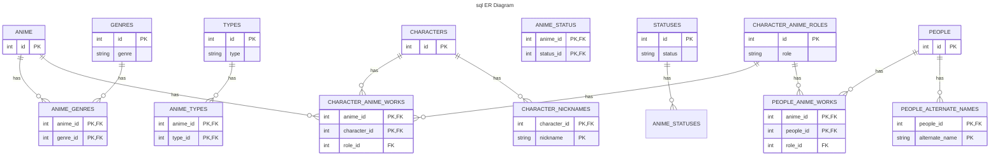

```mermaid
---
title: sql ER Diagram
---
erDiagram
    ANIME {
        int id PK
    }
    GENRES {
        int id PK
        string genre
    }
    TYPES {
        int id PK
        string type
    }
    STATUSES {
        int id PK
        string status
    }
    ANIME_GENRES {
        int anime_id PK,FK
        int genre_id PK,FK
    }
    ANIME_TYPES {
        int anime_id PK,FK
        int type_id PK,FK
    }
    ANIME_STATUS {
        int anime_id PK,FK
        int status_id PK,FK
    }
    ANIME ||--o{ ANIME_GENRES : has
    GENRES ||--o{ ANIME_GENRES : has
    TYPES ||--o{ ANIME_TYPES : has
    STATUSES ||--o{ ANIME_STATUSES : has

    CHARACTERS {
        int id PK
    }
    CHARACTER_ANIME_WORKS {
        int anime_id PK,FK
        int character_id PK,FK
        int role_id FK
    }
    CHARACTER_ANIME_ROLES{
        int id PK
        string role
    }
    ANIME ||--o{ CHARACTER_ANIME_WORKS : has
    CHARACTERS ||--o{ CHARACTER_ANIME_WORKS : has
    CHARACTER_ANIME_ROLES ||--o{ CHARACTER_ANIME_WORKS : has

    CHARACTER_NICKNAMES {
        int character_id PK,FK
        string nickname PK
    }
    CHARACTERS ||--o{ CHARACTER_NICKNAMES : has

    PEOPLE {
        int id PK
    }
    PEOPLE_ANIME_WORKS {
        int anime_id PK,FK
        int people_id PK,FK
        int role_id FK
    }
    PEOPLE_ALTERNATE_NAMES {
        int people_id PK,FK
        string alternate_name PK
    }
    PEOPLE ||--o{ PEOPLE_ANIME_WORKS : has
    PEOPLE ||--o{ PEOPLE_ALTERNATE_NAMES : has
    CHARACTER_ANIME_ROLES ||--o{ PEOPLE_ANIME_WORKS : has
```